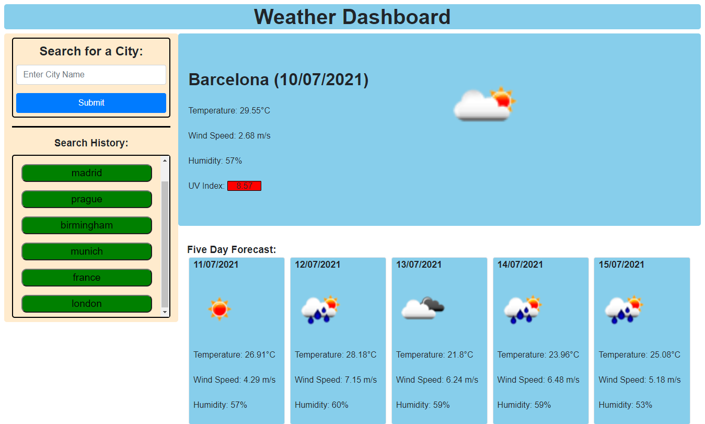

# Weather Dashboard

## Description  

This application makes calls to a server API, in this case both Open Weather 'onecall' and the Open Weather 'Weather' API and using these to get the current weather and a future weather forecast for input cities. A user can enter the name of a city in the search bar and updates the webpage with the current and future weather data and update the search history. When the weather data is shown, it shows the current city name, the date, an icon representation of weather conditions, the temperature, the humidity, the wind speed, and the UV index, and below a 5 day weather forecast with future weather in each smaller card. When a button in search history is clicked, the weather data for that city is shown on the webpage. Upon reloading the webpage, the search history is saved and is rendered to the screen under 'search history'. For the UV index, the background colour changed depending on the value of the index.
  
## Table of Contents  
- [Installation](#installation)
- [Usage](#usage)
- [Credits](#credits)
- [Questions](#questions)
- [License](#license)

## Installation 
No need to install anything, you can use the application as it is hosted at https://kevinjr1998.github.io/Weather_Dashboard/

If you wish to install this locally, you can either clone the repo locally and open the html file in you browser or push to GitHub and use GitHub pages to host the webpage. You can also fork the repo and use GitHub pages to deploy the webpage.

## Technologies 
- OpenWeather APIs
- Bootstrap
- jQuery
- Moment.js

## Usage

## Credits    
https://github.com/kevinjr1998    
  
## License 
This project is covered under the [MIT](https://opensource.org/licenses/MIT) license

## Tests    
No tests required

## Questions
https://github.com/kevinjr1998

For further questions, please contact me at please contact me at kevinryner@yahoo.co.uk     

